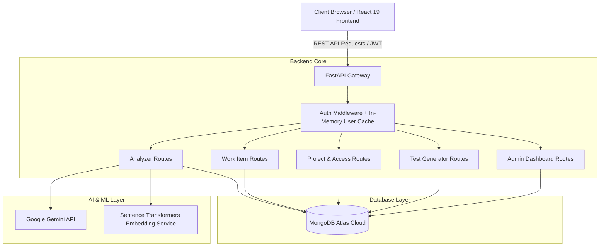

# 🚀 DevAssist — AI Development Assistant

<p align="center">
  
  
  
  
  
  
</p>

---

## 📌 Table of Contents

- [Overview](#-overview)
- [Key Features](#-key-features)
  - [1. AI Requirement Decomposition & Analysis](#1-ai-requirement-decomposition--analysis)
  - [2. Grounded Vector Search & RAG Context](#2-grounded-vector-search--rag-context)
  - [3. Automated QA Test Suite Generation](#3-automated-qa-test-suite-generation)
  - [4. Agile Work Item & Sprint Management](#4-agile-work-item--sprint-management)
  - [5. Role-Based Access Control (RBAC) & Governance](#5-role-based-access-control-rbac--governance)
  - [6. Security & Multi-Session Invalidation](#6-security--multi-session-invalidation)
  - [7. High-Performance In-Memory Caching](#7-high-performance-in-memory-caching)
- [Tech Stack](#-tech-stack)
- [System Architecture](#-system-architecture)
- [Getting Started](#-getting-started)
  - [Prerequisites](#prerequisites)
  - [1. Backend Setup](#1-backend-setup)
  - [2. Frontend Setup](#2-frontend-setup)
  - [3. Environment Variables Configuration](#3-environment-variables-configuration)
- [API Reference](#-api-reference)
- [License](#-license)

---

## 📖 Overview

**DevAssist (AI Development Assistant)** is an enterprise-grade, full-stack AI platform built to accelerate software development lifecycles. By bridging the gap between product requirements, engineering implementation, and quality assurance, DevAssist uses Google Gemini generative models and semantic vector embeddings to automatically parse natural language requirements into:

* **Strict Acceptance Criteria** with sequential functional references (`AC-01`, `AC-02`).
* **Granular Engineering Tasks** ready for developer implementation.
* **REST API Contracts** complete with HTTP methods, payload schemas, and response formats.
* **Database Schemas & Data Models** with table/collection definitions, column types, and constraints.
* **Edge Cases & Failure Scenarios** for robust defensive engineering.
* **Automated QA Test Suites** (Functional, API, Negative, and Boundary test cases) ready for verification.

---

## 🌟 Key Features

### 1. AI Requirement Decomposition & Analysis
* **Multi-format Ingestion**: Upload specification documents (`.pdf`, `.docx`, `.txt`) or enter raw requirement text directly.
* **Scope Selection**: Select specific analysis modules (Summary, Acceptance Criteria, Tasks, APIs, Database Schema, Edge Cases).
* **One-Click Export**: Export comprehensive Markdown analysis reports (`<title>_analysis_report.md`) directly to your machine.

### 2. Grounded Vector Search & RAG Context
* **Duplicate & Similarity Detection**: Generates vector embeddings for requirement criteria using `sentence-transformers` and performs cosine similarity search.
* **Grounded AI Evidence**: References related requirements from the project history and provides visual similarity confidence scores and contextual explanations.

### 3. Automated QA Test Suite Generation
* **Multi-Category Test Coverage**: Generates ready-to-run test cases categorized by Functional, API / Integration, Negative / Security, and Boundary / Edge Cases.
* **Test History & Metrics**: Tracks generated suites, code snippets, total test assertions, and download packages.

### 4. Agile Work Item & Sprint Management
* **Jira-Style Kanban Tracking**: Organize items across `To Do`, `In Progress`, `Done`, and `Blocked`.
* **Auto-Incrementing Custom Project Keys**: Generates standardized IDs (e.g. `NETSOL-001`, `AUTH-042`).
* **Priority & Story Points**: Manage task estimation, category tags, start/end dates, and assignee workload.

### 5. Role-Based Access Control (RBAC) & Governance
* **Persona Dashboards**:
  * **Admin / Product Manager**: 6 KPI overview cards, project health telemetry, workload distribution matrix, needs-attention alert panel, and paginated audit logs.
  * **Developer**: Requirement analysis workbench, project activity line charts, analysis health gauge, and active project selector.
  * **QA / Test Engineer**: Test generator, test history, and coverage analytics.
* **Private Project Access Gate**: Request-to-join workflow for private workspaces with real-time in-app approval notifications.

### 6. Security & Multi-Session Invalidation
* **JWT Authentication with Token Versioning**: Revoke all active logins across other devices from the Security Settings page in one click.
* **Fetch Interceptors**: Global HTTP 401 interceptor automatically clears expired credentials and triggers secure re-authentication.

### 7. High-Performance In-Memory Caching
* **Sub-Millisecond Auth**: 30-second TTL in-memory user cache eliminates database round-trips for session validation (0.5 ms response times).
* **Warm Connection Pooling**: Pre-warmed Motor connections (`minPoolSize=10`) eliminate TLS handshake delays to cloud databases.
* **SWR Client-Side Navigation**: Instant zero-delay tab switching with background revalidation.

---

## 💻 Tech Stack

### **Frontend**
* **Framework**: React 19 + Vite 8
* **Routing**: React Router 7
* **Styling**: TailwindCSS 3.4 + Vanilla CSS Design Tokens (Dark & Light themes)
* **Icons & Animation**: Lucide React + Framer Motion
* **Charts & Visualizations**: Recharts
* **Notifications**: Sonner

### **Backend**
* **API Framework**: FastAPI (Python 3.12, ASGI, Uvicorn)
* **AI Engine**: Google Gemini API (`gemini-2.5-flash` / Google GenAI SDK)
* **Database Driver**: Motor (`AsyncIOMotorClient` for asynchronous MongoDB Atlas operations)
* **Embeddings & Vector Search**: Sentence Transformers / NumPy cosine similarity
* **Authentication**: PyJWT + Passlib (Bcrypt) + OAuth2 Password Bearer

---

## 🏗️ System Architecture



---

## 🚀 Getting Started

### Prerequisites
* **Node.js**: v18.0 or higher
* **Python**: v3.10, 3.11, or 3.12
* **MongoDB**: A free MongoDB Atlas cluster or local MongoDB instance
* **Google Gemini API Key**: Obtainable from [Google AI Studio](https://aistudio.google.com/)

---

### 1. Backend Setup

1. **Navigate to the backend directory**:
   ```bash
   cd backend
   ```

2. **Create and activate a virtual environment**:
   ```bash
   # On Windows PowerShell
   python -m venv venv
   .\venv\Scripts\Activate.ps1

   # On macOS / Linux
   python3 -m venv venv
   source venv/bin/activate
   ```

3. **Install dependencies**:
   ```bash
   pip install -r requirements.txt
   ```

4. **Configure your `.env` file** (see [Environment Variables Configuration](#3-environment-variables-configuration)).

5. **Start the FastAPI server**:
   ```bash
   uvicorn main:app --reload --host 0.0.0.0 --port 8000
   ```
   *The backend will run at `http://localhost:8000` (Swagger docs available at `http://localhost:8000/docs`).*

---

### 2. Frontend Setup

1. **Navigate to the frontend directory**:
   ```bash
   cd ../frontend
   ```

2. **Install Node dependencies**:
   ```bash
   npm install
   ```

3. **Start the development server**:
   ```bash
   npm run dev
   ```
   *The frontend will run at `http://localhost:5173`.*

---

### 3. Environment Variables Configuration

Create a `.env` file in the `backend/` directory:

```ini
# ==============================================================================
# DATABASE CONFIGURATION
# ==============================================================================
MONGODB_URI=mongodb+srv://<username>:<password>@cluster0.mongodb.net/requirement_analyzer?retryWrites=true&w=majority

# ==============================================================================
# AI / LLM CONFIGURATION
# ==============================================================================
GEMINI_API_KEY=AIzaSyYourGeminiApiKeyHere

# ==============================================================================
# SECURITY & AUTHENTICATION
# ==============================================================================
SECRET_KEY=your_super_secret_jwt_signing_key_at_least_32_characters_long
ALGORITHM=HS256
ACCESS_TOKEN_EXPIRE_MINUTES=1440
```

---

## 📡 API Reference

| Method | Endpoint | Description | Role Required |
| :--- | :--- | :--- | :--- |
| `POST` | `/register` | Register a new user account | Public |
| `POST` | `/login` | Authenticate user & issue JWT | Public |
| `POST` | `/auth/revoke-sessions` | Revoke all other active logins | Authenticated |
| `POST` | `/upload` | Analyze requirement document or text | Developer / Admin |
| `GET` | `/history` | List requirement analysis history | Developer / Admin |
| `GET` | `/history/{id}` | Get full analysis details | Developer / Admin |
| `GET` | `/projects` | List all accessible workspace projects | Authenticated |
| `POST` | `/projects` | Create a new project workspace | Authenticated |
| `GET` | `/work-items` | Query agile work items with filters | Authenticated |
| `POST` | `/work-items` | Create a new agile work item | Authenticated |
| `POST` | `/generate-tests` | Generate multi-category unit test suite | QA / Admin |
| `GET` | `/admin/dashboard-stats` | Aggregated SaaS metrics & telemetry | Admin |

---

## 📄 License

This project is licensed under the **MIT License** — see the [LICENSE](LICENSE) file for details.